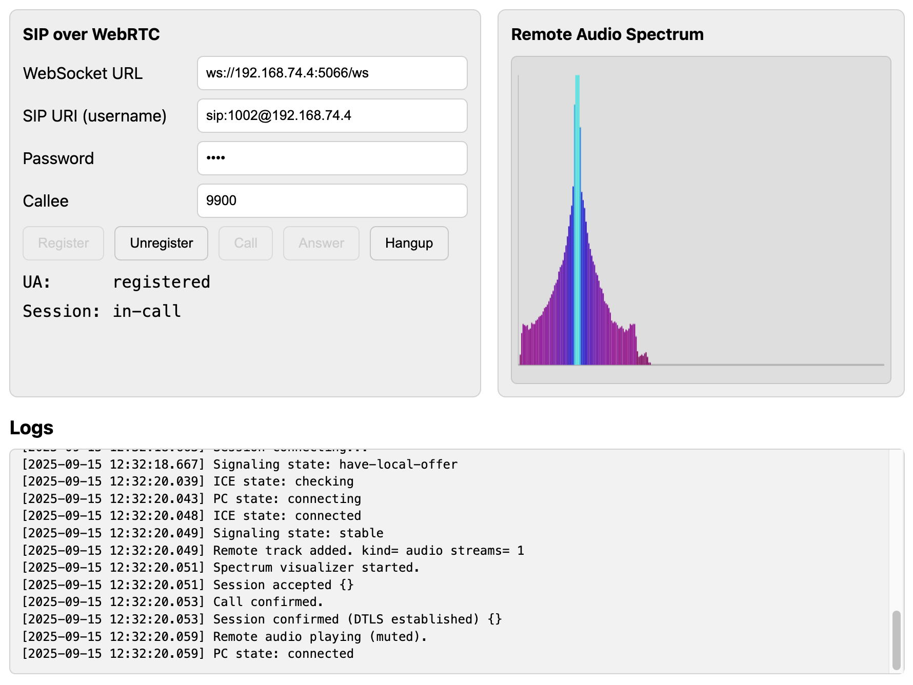

# SIP-over-WebSocket and WebRTC Test Page

This tool helps to test SIP-over-WebSocket and WebRTC systems easily.

The test page is written in simple HTML & JavaScript, it uses JsSIP to communicate with 
SIP WebSocket server (Asterisk, FreeSWITCH, etc), then "Call" can use SIP to start a WebRTC session,
send "Ding" to remote periodicly, and draw received audio as spectrum for visualization.

You can either:

* Deploy the "webroot" to your web server
* Run `go run main.go {port}` to start a simple web server serving "webroot"

Then use a browser to visit the test page, and start the calls.

## Requirements

### Secure Context

WebRTC requries "secure context" (`window.isSecureContext===true`),
so you should use either "https://..." or "http://localhost" or "http://127.0.0.1"
to access the test page.

If you use "https://...", you should also use "wss://..." for the SIP WebSocket,
non-secure "ws://..." doesn't work in the HTTPS page context.

### Non-standard ports for local HTTP sites

If you use a non-standard (not 80) port for localhost, then you must also disable the mDNS RTP candidates.

For example, if you use "http://localhost:port" or "http://127.0.0.1:port",
then the WebRTC hostname will be hidden with "something.local" names by Chrome,
then the SIP servers like Asterisk can't see correct candidates 
and just reports a dummy discard address "Strict RTP learning after remote address set to: 0.0.0.0:9".

Some possible solutions:

1. Allow real local IPs for your dev origins in Chrome, either:
   * Enterprise policy: `WebRtcLocalIpsAllowedUrls = [ more origins ]`
   * Disable mDNS by settings: `chrome://flags/#enable-webrtc-hide-local-ips-with-mdns` → Disabled,
   * Disable mDNS by flags: run Chrome with flag `--disable-features=WebRtcHideLocalIpsWithMdns`
2. Make Asterisk handle mDNS candidates, and install Avahi/Bonjour and nss-mdns
3. Avoid host candidates entirely, provide TURN and set `iceTransportPolicy: 'relay'` for WebRTC

## Screenshot

